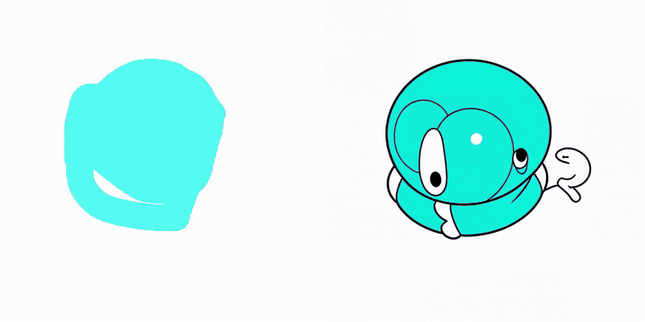
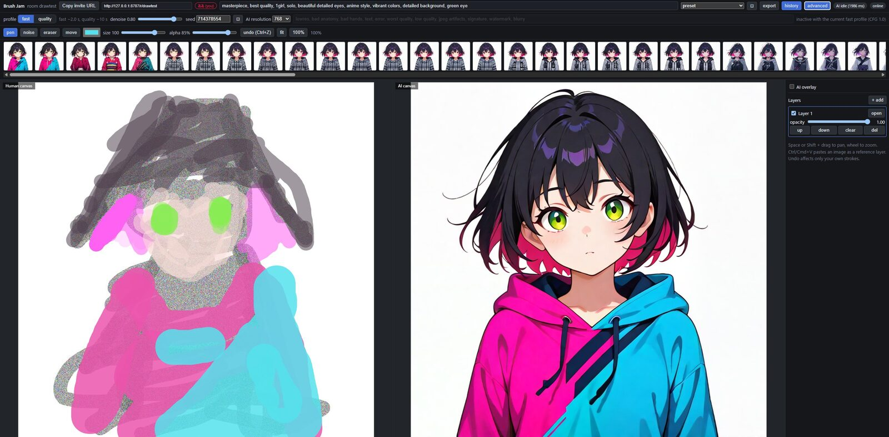

# Brush Jam

[English README](README.md)

[](https://github.com/tokoroten/brush_jam/actions/workflows/ci.yml)





何人かで一枚のキャンバスに描き、その全体を AI が絶えず描き直します。
プロンプト欄の下に絵が出る道具ではなく、キャンバスそのものがプロンプトです。
誰かが一筆置くたびに、絵の *全体* が img2img を通り、1〜2 秒後に隣に結果が出ます。
雑な丘を描けば丘が返ってきて、別の人がその上に家を足せば、次の結果は丘の上の家に
なります。同じ絵を入れているので、画風も揃います。

一人の道具ではなく、部屋に集まった人たちの玩具です。描画はモデルを待ちません。
ストロークは手元で描かれ、すぐ全員に中継され、AI はその後ろで走ります。
プロンプト、denoise、シード、速度/品質の設定は部屋で一つを共有するので、
誰かが変えれば全員が変わり、プロンプトで揉めるのも遊びのうちです。

## 必要なもの

- **Python 3.10〜3.12** と [uv](https://docs.astral.sh/uv/)。サーバーは Python
  プロセス一つです。
- **Node 20 以上と pnpm**。ブラウザクライアントのビルド用で、実行時には不要です。
- **VRAM 8 GB 以上の NVIDIA GPU**、または借りた GPU。`deploy/runpod/` が全部を
  RunPod の pod に載せます(時間あたり数ドル)。GPU が無くても、即座に灰色の
  矩形を返す mock バックエンドで全体が動くので、描画側の作業には足ります。
- **SDXL のチェックポイント**(6〜7 GB の `.safetensors`)。`.env` の
  `INPROC_CHECKPOINT` で指定します。どれでも動きます。既定は
  [Nova Anime XL IL v19](https://civitai.com/models/376130) で、
  `scripts/download_models.py` が取ってくるのも、`docs/` の計測に使ったのも
  これです。Illustrious 系のアニメ寄りモデルで、選んだ理由は Civitai のライセンスが
  他人向けの生成サービスとしての利用を許しているからです。友人のために部屋を
  開くのは、まさにそれに当たります。落とす前にそのライセンスを読み、別の
  チェックポイントに差し替えるときも同じ点を確かめてください。有名なモデルの
  中には、これを禁じているものがあります。写実系や絵画系のモデルでも動きますが、
  プリセットと計測した denoise の値はこのモデルで合わせています。4 ステップの
  DMD2 LoRA と fp16-fix VAE は初回に自動でダウンロードされます。

**VRAM はどれだけ要るか。** 設計基準は 8 GB で、両プロファイルに足ります。
`fast` は 768、`quality` は 1024 でピーク 7 GB 前後。VAE を 256 px タイルで
デコードし、テキストエンコーダを CPU に置くからで、どちらもカードのサイズから
自動で選ばれます。同時に他のものがカードを使うなら、`INPROC_UNET_STORAGE=fp8`
でさらに 2.4 GB 空きますが、一筆あたり 1 秒ほど遅くなります。`fp16` の方が速く、
7 GB 超のカードでは `auto` がそちらを選びます。

## エージェントに任せる

上に書いたことは、人と同じくらいコーディングエージェントが追える形で書いています。
[Claude Code](https://claude.com/claude-code) か
[Codex CLI](https://github.com/openai/codex) があるなら、リポジトリを clone し、
そこで開いて、これを貼ってください。

> このリポジトリを clone した。`docs/SETUP.md` に従って自分の GPU で動かし、
> Cloudflare の quick tunnel で友人が入れる状態にして。必要なものは、必要になる前に
> 教えて。

自分でしか用意できないものは二つです。先に揃えてから頼んでください。

- VRAM 8 GB 以上の NVIDIA GPU(無ければ mock バックエンド)
- [Civitai](https://civitai.com/) のアカウントと API トークン(チェックポイント用)

トンネルにアカウントは要りません。`cloudflared` が使い捨ての URL を誰にでも出します。

エージェントは Node、pnpm、uv を入れ、クライアントをビルドし、モデルを落とし、
`.env` を書き、サーバーを起動して、部屋の URL を渡してきます。`CLAUDE.md` も
エージェント向けで、このリポジトリの地図と落とし穴が書いてあります。

## クイックスタート

```bash
git clone <this repo> && cd brush_jam
pnpm install
pnpm build                       # web クライアントを Python パッケージに組み込む

cp .env.example .env             # 続けて INPROC_CHECKPOINT を書く(下記)

cd apps/brushjam
uv sync --extra inproc           # torch + diffusers
cd ../..

pnpm start                       # http://localhost:8787
```

Python サーバーはクライアントを自分で配信します。場所は
`apps/brushjam/src/brushjam/static` で、そこに置くのが `pnpm build` です
(`vite build` の後、`scripts/build_web.py` が `apps/web/dist` をコピーします)。
起動中のサーバーは、このコマンドを再実行するまで前回のビルドを配り続けます。
`apps/web/` 以下を触ったら、ビルドし直すか `pnpm dev` を使ってください。
`pnpm dev` は同じ Python サーバーの前に、ホットリロード付きの Vite 開発サーバーを
:5173 で立てます。

**GPU が無い場合**は extra 無しで入れ(`uv sync`)、`.env` に `AI_BACKEND=mock`
と書きます。モデル以外はすべて動き、モデルは即座に灰色の矩形を返します。
`AI_BACKEND=inproc` は希望ではなく指示なので、満たせないときは黙って別のものを
動かすのではなく起動を拒否します。ComfyUI、次いで mock に落ちるのは
`AI_BACKEND=auto` の方です。

チェックポイントがまだ無いなら:

```bash
uv run --project apps/brushjam python apps/brushjam/scripts/download_models.py
```

`./models/checkpoints/` に一つ落とし、`.env` に貼る `INPROC_CHECKPOINT=` の行を
印字します。(Civitai はほとんどのモデルでアカウントを要求します。先に `.env` に
`CIVITAI_TOKEN` を書いてください。`CIVITAI_VERSION` で別のモデルバージョンを
選べます。)

続けて <http://localhost:8787> を開き、名前を決めて **Create room** を押し、
`/r/<id>` の URL を誰かに送ります。左に描くと、右に AI の版が出ます。
起動ログが、どのバックエンドをなぜ選んだかを言います。

```
[brushjam] backend: inproc, sdxl-illustrious.safetensors resident in this process
[brushjam] server on http://127.0.0.1:8787
```

`AI_BACKEND=auto` で torch もチェックポイントも無ければ、ComfyUI が動いていれば
そちらに、無ければ mock に落ち、どちらをなぜ選んだかを言います。
`AI_BACKEND=inproc` なら代わりに起動を拒否します。明示された選択を満たせないのは
エラーであって、黙って回避するものではないからです。

## 友人と遊ぶ

**LAN 内**なら、全インターフェースに bind して自分のマシンのアドレスを渡します。

```bash
HOST=0.0.0.0 pnpm start          # then http://<your-ip>:8787/r/<id>
pnpm dev:lan                     # 同じものを Vite 開発サーバー付きで
```

**自分のマシンからインターネットへ**出すなら、前にトンネルを置きます。

```bash
cloudflared tunnel --url http://127.0.0.1:8787    # trycloudflare.com の URL が出る
```

Cloudflare の quick tunnel はアカウント不要で、転送量の上限がありません。
**ngrok の無料プランは使わないでください。** 月 1 GB の転送量上限があり、生成結果は
1 枚 0.5〜1.4 MB の PNG を全員が毎回取りに行くので、8 人の部屋では 40 分ほどで
ひと月分を使い切りました。上限に達しても張りっぱなしの WebSocket で描画は同期し
続け、AI キャンバスだけが止まるので、サーバーの故障に見えますが違います
(`ERR_NGROK_725`)。ngrok の有料プランなら問題なく、身内だけなら Tailscale が
向いています。サーバーは WebSocket 込みで全部を一つのポートで配り、
ページが https ならクライアントが自分で `wss://` を選びます。先に
`ROOM_CREATE_PER_MIN` を上げてください。サーバーはソケットの接続元アドレスで
レート制限し、`X-Forwarded-For` を読まないので、トンネルの裏では全員が一つの
バケツを分け合います。手順は [`docs/SETUP.md`](docs/SETUP.md) に一段ずつ
書いてあります。

**借りた GPU でインターネットへ**出すなら、RunPod の pod にサーバーを置きます。
`deploy/runpod/` が pod を作り、このリポジトリを tarball にして送り込み、起動
します。SSH もレジストリも git remote も使いません。

```bash
uv run --project apps/brushjam python deploy/runpod/deploy.py deploy
```

初回起動、再デプロイの費用、監視の仕方は [`docs/RUNPOD_POD.md`](docs/RUNPOD_POD.md)
にあります。pod の URL を知る人は誰でも入れるので、リンクが唯一のアクセス制御だと
思ってください。

## 操作

- **ツール。** ペン、消しゴム、**ノイズペン**、レイヤー全体を動かす移動ツール。
  ノイズペンの模様はワールド座標からハッシュされるので、全員で同一、どう切り
  出しても安定しています。色見本はペン以外では灰色になります。ノイズは自分の
  色を持ち、消しゴムは消し、移動は何も塗らないからです。Ctrl/Cmd+V で参考画像を
  レイヤーとして貼れます。レイヤーパネルで横の「AI input」に印を付けるまで、
  AI の入力には入りません。
- **ブラシサイズ。** ポインタの下のリングがブラシで、実際に置かれる大きさです。
  スライダーの単位はワールドピクセルで、キャンバスはたいてい縮小表示されている
  ので、数字だけではほとんど何も分かりません。描画ツールが有効な間はマウス
  ポインタの代わりになり、リングで示せないほど小さいときは小さな十字になります。
  筆圧は本物のペンからしか読みません。マウスは Pointer Events 仕様がセンサー
  無しの機器に割り当てる定数 0.5 を報告するので、マウスのストロークは最大幅で
  描かれます。
- **レイヤー。** 右のパネル。表示、不透明度、順序、ロック、そしてレイヤー全体を
  ずらす移動ツール。レイヤーは描画時に平行移動されるので、ログ内のストロークは
  動きません。レイヤーの移動は undo できません。
- **オーバーレイ。** レイヤーパネルの一番上。AI の結果を自分のキャンバスに、
  選んだ不透明度(既定 40%)で重ねます。なぞるためのものです。雑な丘を描き、
  モデルに丘にしてもらい、モデルが考えたものの上に描く。**Tab** を押している間、
  実際に自分が描いたものが見えます。**pin** は絵を固定し、次の生成で手の下の絵が
  動かないようにします。履歴のどの項目も同じように pin できます。これは自分だけの
  もので、部屋の他の人には見えず、「save drawing」にも含まれず、AI にも見えません。
- **プロンプト。** 共有。キャンバス全体を導きます。ネガティブプロンプトは
  Advanced にあり、`fast` では効きません。CFG 1.0 の蒸留モデルはネガティブ側を
  評価しないので、UI は効くふりをせず灰色にします。
- **プリセット。** プロンプト横のピッカーで、二十数種の見た目から埋めます。
  基本 / basic(anime girl、landscape、impressionist、architecture、
  background art)、画風 / style(sumi-e、ukiyo-e、stained glass、pixel art、
  watercolour picture book、claymation、papercraft)、題材 / subject(fantasy
  map、creature design、nebula、food、satellite view、mecha blueprint、
  botanical)、雰囲気 / mood(neon city、horror、retro poster、photorealistic)、
  そして末尾に単独で R18(NSFW)。R18 はサーバーが `PRESETS_R18=1` で起動された
  ときだけ出て、それ以外は隠れます。これはメニューのゲートであって、それ以上では
  ありません。どのクライアントもどんなプロンプトも送れ、サーバーは受け取り、
  中身は見ません。ピッカー横の ⚀ はランダムに一つ引きます。グループの表示に
  関わらず R18 には当たりません。プリセットは欄を埋めるだけで、プロンプトは
  編集でき、サーバー側は使われたことを知りません。ただし多くは denoise も
  動かし、十個は部屋を `quality` に切り替えます。その見た目にはそれだけかかる
  からです(下記)。
- **fast / quality。** Advanced に、他の AI 設定と一緒にあります。`fast` は
  768 での 4 ステップ蒸留 LoRA で、3070 なら一筆 2 秒ほど。ループが生きて
  感じられるのはこれのおかげです。`quality` は 1024 での 14 ステップで、数倍
  遅く、かなり良い。部屋全体の設定です。

  **画風の代金はステップであって denoise ではない。** `fast` ではサンプラーが
  CFG 1.0 で 4 ステップ回ります。プロンプトはほとんど効かず、ネガティブ側は
  一切評価されないので、そこで denoise を上げても見た目は買えず、別の絵が
  買えるだけです。`quality` では同じ言葉が効き、*かつ* denoise 0.8 まで構図が
  残ります。pixel art 以外の画風プリセットが全部 `quality` を求めるのはその
  ためで、見た目の正直な値段です
  ([`docs/experiments/2026-09-07-presets/`](docs/experiments/2026-09-07-presets/REPORT.md))。
- **denoise。** モデルがどこまで絵から離れてよいか。低いと塗り直し、高いと
  描き直し。`fast` には 0.8 が合います。
- **シード。** 生成ごとに引き直すのではなく、部屋で一つを持ちます。一筆足すと
  絵がシャッフルされるのではなく変化するためです。欄の横のサイコロは、同じ絵から
  別の絵を求めます。
- **解像度。** 生成サイズ。結果はキャンバスに拡縮されます。

`pnpm latency` で計測した、`stroke_end` からピクセルまでの時間:

| | `fast` / 768 | `quality` / 1024 |
| --- | --- | --- |
| RTX 3070 8 GB、ローカル | 2.2 s | 9.4 s |
| RTX 4090 RunPod pod | パイプライン 0.8 s、クライアント到達 1.5 s | 3.1 s |

## 保存と履歴

ヘッダーの **export** が、部屋から持ち出す全部の方法を一つのダイアログで開きます。

- **Download drawing (PNG)**。表示中のレイヤーをブラウザ内でキャンバスサイズに
  合成したもの。白地で、ステージの見た目そのまま。
- **Download AI image (PNG)**。現在の AI 結果を、サーバーから PNG で。
  どちらも `brushjam-<room>-<revision>-drawing.png` / `-ai.png` として落ちます。
- **Export history as ZIP**。`history.zip`。保存された全フレームを、
  `draw_NNNNN.jpg`(モデルに渡したキャンバス)と `gen_NNNNN.jpg`(モデルが
  作ったもの)で、さらに各フレームの設定を記した `manifest.json` 付きで。
  プロンプト、ネガティブプロンプト、denoise、シード、プロファイル、解像度、
  レイテンシ、生成したチェックポイントと LoRA。サーバーが入力を保存するように
  なる前の項目には `draw_NNNNN.jpg` が無く、manifest にそう書いてあります。
- **Download video (Motion JPEG AVI)**。`history.avi`。左に絵、右に結果、
  生成ごとに 1 フレーム、2、4、8 fps。VLC で再生でき、どの動画編集ソフトでも
  開けます。`HISTORY_EXPORT_MAX_FRAMES`(3000、既定の 4 fps で 12 分)を超えると
  代わりに zip を返します。

後ろの二つは、`HISTORY_ENABLED=0` で起動したサーバーや、まだ何も生成していない
部屋では、理由を添えて灰色になります。

**history** は、部屋が作った全 AI 結果の帯を新しい順に開きます。サーバーは
受理した結果を一つずつ `HISTORY_DIR`(既定 `./data/history`)に JPEG と JSON で
書きます。JSON にはプロンプト、ネガティブプロンプト、denoise、シード、
プロファイル、解像度、レイテンシ、モデルが記録されます。サムネイルを押すと
大きく表示され、設定、ダウンロードリンク、**use these settings**、**pin as
overlay** が出ます。use these settings はプロンプト、ネガティブプロンプト、
denoise、シードを部屋に戻しますが、プロファイルと解像度は戻しません。それらは
見た目の一部ではなく、いまその機械にできることだからです。

履歴は部屋ではなくディスクにあるので、部屋の追い出しやサーバーの再起動を生き延び、
もう存在しない部屋でも `GET /rooms/{id}/history` は答えます。各部屋は項目の横に
小さな `counter` ファイルを持ちます。画像 URL は immutable として配信されるので、
番号は渡した時点で消費され、それを使った項目が全部追い出された後でも二度と
回ってきません。カウンタ導入前に書かれた部屋は、何かが追い出される前の起動時に
カウンタを得て、その書き込みが失敗したら追い出されずに保持されます。その場合、
どの番号が使われたかの唯一の記録はファイル名です。項目とは JPEG *と* JSON の
組で、JSON が後に書かれます。書きかけの組、たとえば残った `.part` は次に
ストアを読んだときに片付けられ、消せなければ数えて再試行します。ディスクを
埋めないための予算が二つ、`HISTORY_ROOM_MB`(200)と `HISTORY_TOTAL_MB`(2000)で、
古い順に追い出されます。`HISTORY_ENABLED=0` で全部止まります。

## 仕組み

Python プロセス一つ(`apps/brushjam`)が、ビルド済みクライアント、部屋の
プロトコル、推論を配ります。サーバーはこれだけです。

- **真実はログ。** 部屋は追記専用のストロークログと、undo されたストローク id の
  集合を持ちます。ラスタはすべて派生物で作り直せるので、再接続したクライアントは
  `snapshot` を受け取り、正確に追いつきます。`undo` は *送信者自身の* 最新
  ストロークを戻します。何人かが同時に描いていても使えるのはそのためです。
- **AI は全部を見る。** `AI_DEBOUNCE_MS` の静けさの後、スケジューラがキャンバス
  全体をサーバー側で、ブラウザと同じレンダラで描き、バックエンドに渡します。
  部屋あたり実行中は一つ。実行中の活動はちょうど一つだけ後ろに並び、最後に
  受理したものより古い結果は捨てられます。各描画レイヤーのラスタは生成間で
  保持され、新しいストロークだけがその上に描かれるので、一時間続いた部屋も
  始まったばかりの部屋と同じ速さで描けます。
- **誰も機械を独占しない。** 生成はラスタライズの *前に* プロセス全体のスロットを
  取って入場し、await が返るまでではなく、仕事が物理的に止まるまで持ちます。
  部屋への参加はリースを取るので、再接続したタブは自分の後ろに並ばず、自分の
  席を引き継ぎます。部屋の作成、部屋あたりのソケット数、総ソケット数、部屋の
  ストロークログの大きさには上限があります(`.env.example` の「limits」)。
- **描画は待たない。** ストロークはポインタ入力で手元に描かれ、約 40 ms ごとに
  チャンクで中継されます。その経路はモデルに触れません。
- **プロトコルが契約。** `packages/shared/src/protocol.ts` が全メッセージを定義し、
  サーバーはリデューサに渡す前に一つずつ検証します。

## 構成

```
apps/brushjam/         サーバー: クライアント、プロトコル、推論を一つのプロセスで
  src/brushjam/room.py        権威あるリデューサ(ストローク、undo、レイヤー、設定)
  src/brushjam/runtime.py     ソケット、プレゼンス、AI ラスタ、部屋の追い出し
  src/brushjam/scheduler.py   デバウンス、単一実行、古い結果の破棄
  src/brushjam/history.py     ディスク上の保存結果
  src/brushjam/export.py      zip と動画
  src/brushjam/ai/pipeline.py 常駐する SDXL モデル
  src/brushjam/ai/backends/   inproc | stream | comfyui | runpod | mock
  src/brushjam/static/        ビルド済みクライアント(pnpm build がここに置く)
  scripts/                    download_models, build_web, bench_render, preset_sheet, ...
  tests/                      435 テスト、凍結したパリティ fixture を含む

apps/web/              ブラウザクライアント(Vite + React 19)
packages/shared/       プロトコル、幾何、プリセット、両側が使うレンダラ
tools/                 起動中のサーバーに HTTP/WS だけで当たるスクリプト
apps/stream-worker/    任意: モデルを別マシンに
deploy/runpod/         サーバーを借りた GPU に置く
```

## 開発

```bash
pnpm dev            # Python サーバーを :8787、Vite をホットリロード付きで :5173
pnpm dev:lan        # ...両方を LAN から届く形で

pnpm py:test        # Python のテスト
pnpm test           # TypeScript のテスト
pnpm typecheck

pnpm smoke -- --url http://127.0.0.1:8787          # 実際の生成を一回
pnpm latency -- --url http://127.0.0.1:8787 --n 5  # 一筆あたりのレイテンシ
pnpm playtest-sim -- --url http://127.0.0.1:8787 --users 3 --minutes 1
```

CI は push ごとにテストコマンド三つを回し、次に `pnpm build` とデプロイツールの
自前のチェック(ビルド済みクライアントが入る tarball を固める)を回します。

[`tools/`](tools/README.md) の三つのスクリプトは公開の HTTP と WebSocket だけを
話すので、ローカル、リモート、pod のどれであれ、実際に聞いているものを計ります。
`AI_BACKEND=mock` はモデル無しでサーバー全体を動かし、テストとクライアント作業の
大半はこれで済ませています。

`apps/brushjam/scripts/` の下がカードを欲しがる方です。`bench_render.py` は AI
入力の描画時間を計り、`verify_unfuse.py` は fast の LoRA を外すと quality
プロファイルにモデルが戻ることを確かめ、`compare_checkpoints.py` は同じ絵を二つの
チェックポイントに、一度に一モデルずつ通します。`preset_sheet.py` は自分では
カードを要らず、*起動中の* サーバーに普通のクライアントとして当たってプリセットの
一覧表を作ります。

## ドキュメント

- [`docs/SETUP.md`](docs/SETUP.md)。セットアップマニュアル(日本語)。インストール、
  モデル、`.env`、LAN、Cloudflare tunnel / Tailscale / RunPod での公開と、ngrok の
  無料プランを使わない理由。
- [`docs/PYTHON_SERVER.md`](docs/PYTHON_SERVER.md)。サーバー。バックエンド、
  スケジューリング、上限、計測、レビュー履歴。
- [`docs/RUNPOD_POD.md`](docs/RUNPOD_POD.md)。借りた GPU への配備。
- [`docs/STREAM_WORKER.md`](docs/STREAM_WORKER.md)。リモートのモデルホストと、
  8 GB で SDXL を本当に速くするものは何かの長い記録。
- [`docs/RUNPOD.md`](docs/RUNPOD.md)。サーバーレスエンドポイント。撤去済みだが
  計測あり(歴史)。
- [`docs/MVP_PLAN.md`](docs/MVP_PLAN.md)。当初の計画(歴史)。
- [`docs/experiments/`](docs/experiments/)。denoise の掃引、チェックポイント比較、
  プリセットの書き直し。それぞれ `REPORT.md` 付き。
- [`CLAUDE.md`](CLAUDE.md)。ここで作業する AI エージェント向けの家の決まり。

## 制限と既知の問題

- **設計基準は 8 GB** で、余裕はありません。VAE は 256 px タイルでデコードし、
  テキストエンコーダは CPU に退避します。`quality` の 1024 は 8 GB のうち 7 GB
  前後でピークします。どちらもカードのサイズから自動です。他のものがカードを
  使うときは `INPROC_UNET_STORAGE=fp8` でさらに 2.4 GB 空き、一筆 1 秒ほど
  遅くなります(docs/PYTHON_SERVER.md の「8 GB cards」)。
- **一つの GPU に一つのモデル。** 8 GB のカードで ComfyUI とこのサーバーを同時に
  動かすと、どちらかが OOM します。モデルを別マシンに置けるように `stream`
  バックエンドがあります。
- **`fast` ではネガティブプロンプトは何もしません。** CFG 1.0 の蒸留モデルは評価
  しません。UI がそう言います。
- **同じアドレスの裏にいる全員がレート制限を分け合います。** RunPod の pod では
  プロキシのせいで全員が一人のクライアントに見えるので、pod の設定は
  `ROOM_CREATE_PER_MIN` を上げています。
- **白地の薄い線画は弱くしか描き直されません。** モデルに手がかりが少ないから
  です。サーバー設定より、denoise、プロンプト、塗った背景の方が効き、画風に
  噛ませる一番手早い手はノイズペンです。
- **再起動で全部屋が消えます。** ストロークはメモリにあり、ディスクにあるのは
  保存された履歴の JPEG だけです。
- redo は無く、`clear_layer` は undo できません。

## ライセンス

MIT。[LICENSE](LICENSE) を見てください。
